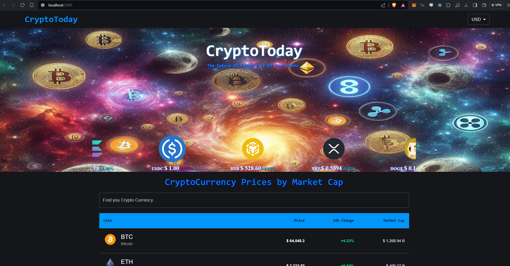
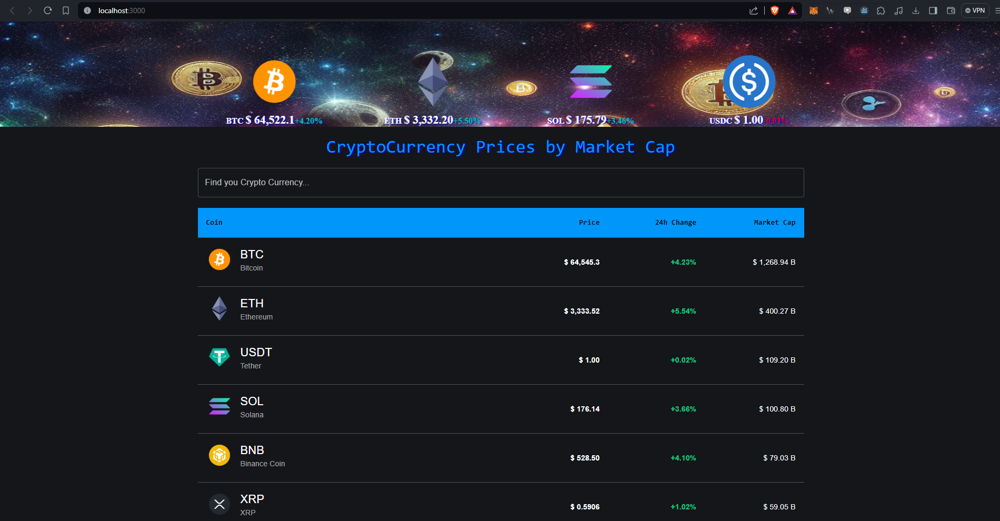
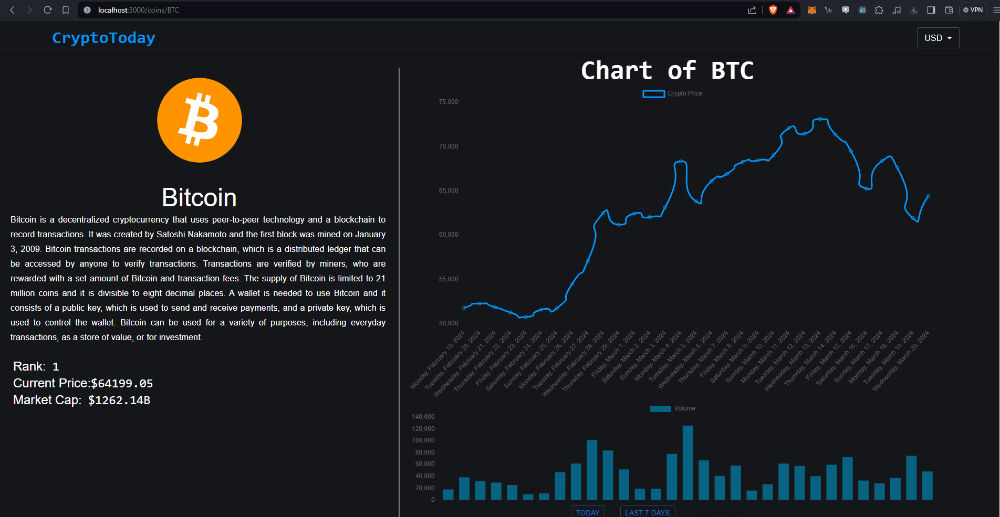

# Cryptocurrency Visualization Web Application

This project is a web application designed to visualize cryptocurrency-related information using the **CryptoCompare API**. It is built using **React.js**, a popular JavaScript framework for building user interfaces, and leverages **Material-UI** for designing and styling the visual components.



## Features

- **Real-time Cryptocurrency Prices**: View real-time prices of cryptocurrencies in various fiat currencies (e.g., USD, EUR).
- **Interactive Historical Charts**: Explore historical price and trading volume data with interactive charts.
- **Trending Cryptocurrencies**: A carousel showcasing the most popular cryptocurrencies at the moment.
- **User-friendly Navigation**: Seamless navigation through the application with an intuitive menu.



## Pages

- **Homepage**: Displays a table of cryptocurrencies ranked by market capitalization.
- **Cryptocurrency Details**: Provides detailed information about individual cryptocurrencies.
- **Historical Charts**: Shows historical price and volume data for selected cryptocurrencies.

## Technologies Used

- **React.js**: For building the user interface.
- **Material-UI**: For designing and styling components.
- **CryptoCompare API**: For fetching cryptocurrency data.

## Getting Started

### Prerequisites

- Node.js and npm installed on your machine.

### Installation

1. Clone the repository:
   ```bash
    git clone https://github.com/SrCidm/crypto-pagev1.git
    ```
2. Navigate to the project directory:
    ```bash
    cd crypto-pagev1
    ```
3. Install dependecies
    ```bash
    npm install
    ```
4. Start the development server:
    ```bash
    npm start
    ```
## Enviorment Variables
- To run this project, you will need to set up the following environment variable in a .env file:
    ```bash
    REACT_APP_API_KEY=your_cryptocompare_api_key
    ```
## Deployment

- This project can be deployed on Netlify or any other static site hosting service. Follow these steps to deploy:

1. Build the project:
    ```bash
    npm run build
    ```
2. Deploy the build folder to your preferred hosting services

## Contributing

- Contributions are welcome! Please fork the repository and create a pull request with your changes.

## License

This project is licensed under the MIT License. See the LICENSE file for details.

## Acknowledgments

- CryptoCompare for providing the API.

- Material-UI for the UI components.

- React.js for the framework.